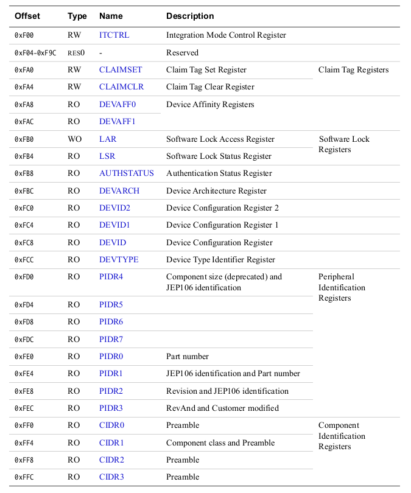
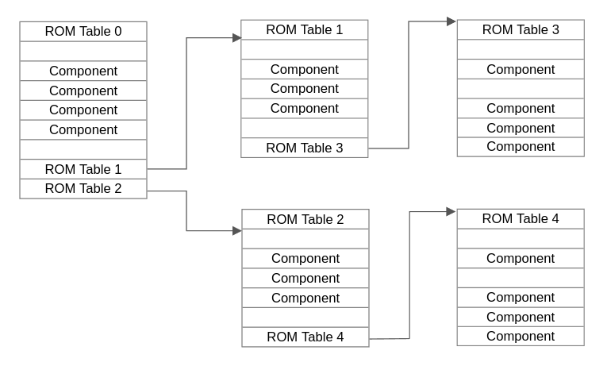
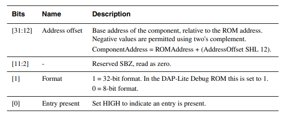
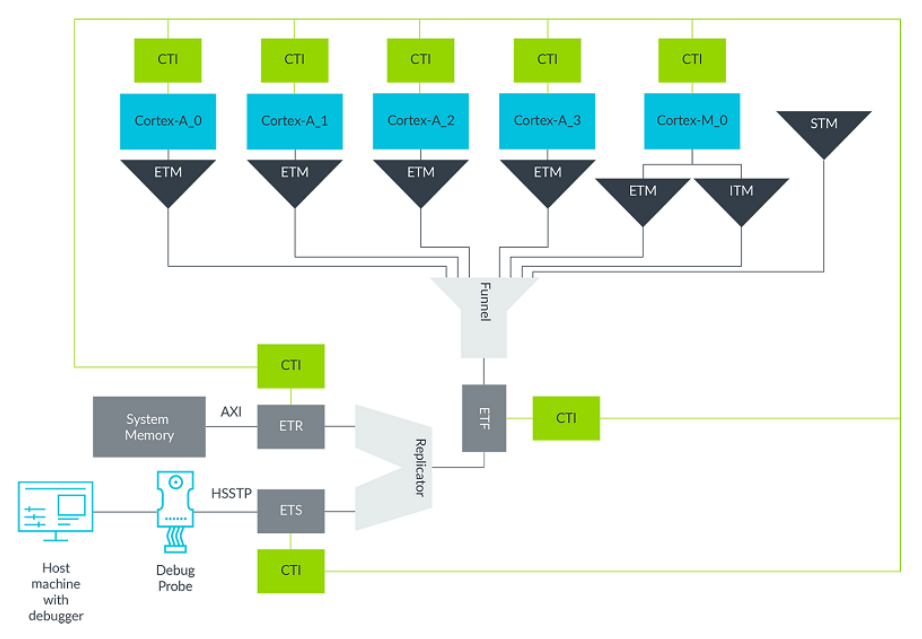

[toc]
# About
This documentation is about the basic knowledge of ARM CoreSight Trace Module and CoreSight Access Library from software programmer's perspective. 
Last updated: 30.9.2022
Next iteration: Understand trace formatter.

# ARM Coresight Trace Module
To get an overview of ARM CoreSight, carefully read [Learn the Architecture - Understanding Trace](https://documentation-service.arm.com/static/62d6a358b334256d9ea8fb6a?token=).

## Memory-mapped Devices
Before we start, let's talk about memory-mapped devices. This is how CoreSight system is exposed to software.

On computer system, hardware devices can be used for storage are usually mapped to a range of physical address, e.g. 64 Byte register can be represented by address range from 0x00000100 ot 0x00000200, writing to these memory addresses will also change the value of the register.

In CoreSight system, there are different types of components for different use. Each component is actually a set of registers which are also memory-mapped. These registers contain information and configuration interface of the component, we will see how the components are organized in physical address range in the following chapters.

However, some components are not configurable, e.g. replication, non-programmable funnel. They might not be memory-mapped, and can not be found in ROM table. These components are called static or hidden components.

## Trace 
| Type | Description | Components |
| ---- | ---- | ---- |
| Instruction Trace | Information about the instruction execution of a core or processor. | ETM (ARMv8), PTM (ARMv7) |
| Data Trace | Information about data access of a core or processor. | ETM |
| Instrumentation Trace | Application-level events instrumented by application programmer. | ITM |
| System Trace | Superset of instrumentation trace, including both software and hardware intrumented data. | STM |

## Components
CoreSight components are categorized into three different types.

- Trace Source ： Trace components generate trace data.
- Trace Sink ： Trace components store and output trace data, endpoint of the trace data.
- Trace Link ： Components link trace and non-trace components together.

Typically, trace data is first generated by trace source, then run through the trace link, finally reach trace sink and then stored there until read by hardware debuger and software.

#### Trace Source

| Name | Description |
| ---- | ---- |
| ETM | Generate compressed instruction and data trace based on configuration (filters and triggers). Filters allow to control how much and what kind of trace data is generated. Triggers act like a start point of trace, ETM only enerates trace data around the trigger point. |
| PTM | Similar to ETM, only exist before ARMv8. |
| ITM | Interface between application programmer and CoreSight system. Application programmer can inject data into trace stream by using memory-mapped write to ITM, this is called instrumentation. Instrumentation allows programmer to do printf-style debugging and report certain events (with timestamp, etc. |
| STM | Superset of ITM, besides software interface, also supplies hardware interface. |

#### Trace Sink

Trace Memory Controller, which can store and stream data, has four different configurations. Each of these four configuration plays as a different components in CoreSight system. The most common two are ETB and ETF.

| Name | Description |
| ---- | ---- |
| ETB | Contains a dedicated SRAM that stores trace data on-chip for later retrieval. The size is typically only from 4 KB to 64 KB. |
| ETF | Contains a dedicated SRAM that can be used as either a buffer (same as ETB), or a software/hardware FIFO (smooth out fluctuations in trace data). |
| ETR | ETR can route data to system memory, allows large amount of trace data to be stored. ETR programmer decides where to store the trace data in memory. |
| TPIU | Another sink components not based on TMC, used as the interface for external debugger to capture trace data at run time. |

#### Trace Link

| Name | Description |
| ---- | ---- |
| Funnel | Merges multiple data streams into a single stream. Typically the merged stream will be routed to another trace component, e.g. another funnel, ETB. Funnel comes in two types, configurable and non-configurable. |
| CTI | Communicate events between different trace components and other CoreSight components, can select which event shall be broadcasted and on which event you want to react. |
| Replicator | Enable writing single trace stream to two sinks at the same time. Replicator is always non-configrable. |

#### Components Internal Organization

We already know components are a set of memory-mapped registers. The size of a single components is typically 4 KB. And the registers of a components can be further categorized: 

| Name | Address Range | Description |
| ---- | ---- | ---- |
| device-specific registers | 0x000 - 0xEFF | Vary between different types of components. |
| CoreSight management registers | 0xEFF - 0xFFF | Exist and have same organization in all components, although some might not be used. |

The assignment of CoreSight manangement registers is as below:



#### Software Lock Mechanism

Some SoC deisgn allows cross-core components access, this might cause problm, e.g. accidentally disable components on other cores and make those cores impossible to be debugged. So, ARM introduces software lock mechanism to prevent accidental access to CoreSight components.  If a component is locked, it is not accessible by software.

Software lock mechanism is controlled by LAR and LSR register. Write 0xC5ACCE55 to LAR to unlock component.

| Name | Address | R/W  | Description |
| ---- | ---- | ---- | ---- |
| LSR | 0xFB4 | Read Only | Show SLK status of current component, bit[0] indicates if SLM is implemented, bit[1] indicates if the components is locked. |
| LAR | 0xFB0 | Writable | Only when LAR = 0xC5ACCE55, the component is unlocked. The value of LAR influences bit[1] of LSR. |

To ensure that the CoreSight components are not corrupted, the software being debugged must unlock the component before accessing any components, and lock the component again before exiting.

## ROM Table
ARM requires that SoC must have a ROM table that contains all discoverable components. This ROM table is also memory-mapped and can be accessed by software. It's base address can be found in MEM-AP register.

ROM table is a link-like structure, where some entries may point to another ROM table. A ROM table always occupies 4 KB memory range, and the first entry is always the current ROM table itself.


The bit assignment of ROM table entry is:



Some non-configurable components as we discuss before won't be registered in ROM table, these are also called static or hidden components.

## Topology

Example shows four Cortex-A class cores and one Cortex-M class core.



# CoreSight Access Library
CoreSight Access Library (CSAL) is an open source project maintained by ARM official. It is for using CoreSight system from software.

This project contains:
- Tools for detecting components and topology.
- APIs for interacting with CoreSight. 
- Demos showing how to use the APIs.


## Tools
| Name | Description |
| ---- | ---- |
| csinfo | Kernel module to find ROM table base address. |
| csscan | Python script to scan ROM table, detect components and topology.|
| csls | Binary file using CSAL APIs (same as tracedemo) for CoreSight system detection. |

## APIs
The main modules are:
- CoreSight components and topology registration.
- Device programming APIs
- Device register offset and value definitions

See `<CSAL>/doc/html/modules.htmls` to find all the modules provided by CSAL APIs. 

## Tracedemo
This chapter is about the analysis of tracedemo example, which tries to dump a range of physical memory and output generated trace data. The whole process of tracedemo can be divided into 6 steps:
- Register CoreSight configuration.
- Enable trace
- Dump physical memory
- Disable trace
- Fetch and print trace data
- Shutdown CoreSight

> Code in this chapter is not deep and complete enough. It only explains how to use CSAL APIs for tracing, but not the internal implementation. If readers want to learn how to write new APIs on their own, please look into the full source code.

#### Board configuration and registration
To make a board supported by CSAL, the CoreSight configuration of the board must be added into `<CSAL Project>/demos/cs_demo_known_boards.c` first. 

Add a new board:
- Add a new entry in `know_boards[]`
- Then write a new registration function. 
  
The common process of a registration function is:

1. Register all devices in any order.
   - All registered devices are maintained out of order in a link table. When a new device is registered, it will be added to the end of the link table. `cs_device` is used to represent a single device. `cs_device.next` points to the next device in link table. Link table starts at `global.device_top`, is also where devices traversing starts.
   - Non-programmable components, like static funnel, doesn't need to be registered, but somehow replicator must to be created by `cs_atb_add_replicator()` and then registered according to existing examples?
   - Can be done either manually via `cs_device_register()` or automatically via `cs_scan_romtable()`.
<br>
1. Set CPU affinities if required.
   - Trace components (pmu, etm, cti) in same core will be linked together and registered in `cs_device.v.debug` by `cs_device_set_affinity()`.
   - This might be necessary to be configured, but not sure yet. For example, ETM might retrieve data only from PMU on its own core.
<br>
3. Register ATB connections between trace devices.
   - Device connection information is stored as the port-related members in `cs_device`.
   - Can be done through `cs_atb_register()`, indicating from which port a device connects to a port on another device.
<br>
4. Register trigger connections between non-CPU devices and CTIs.
   - CTI connection will be registered in `cs_device.v.cti.src[CTI_MAX_IN_PORTS]` and `cs_device.v.cti.dst[CTI_MAX_IN_PORTS]`
   - Done by `cs_cti_connect_trigsrc()` and `cs_cti_connect_trigdst()`.
<br>
1. Register `cs_devices_t`, the structure contains all core devices used for tracing.
   - Trace sink must be registered here. 
   - It's not necessary to register trace source components if we have already set their CPU affinities for them. This will be dnoe as well in the later trace configuration phase.
   - `cs_devices_t.cpu_id[]` indicates what type each core on the board is, e.g. Cortex-73. This is only used for printing debugging information as far as I know, not necessary.

Key structures used for device registration and management:

```C
/* Contains global information of current CSAL library. */
struct global {
    struct cs_device *device_top; // Registered devices are maintained by a link table, this is the start point.
    ....
};
```

```C
/* Represent a single component, same as cs_device_t, these two can be converted to each other. */
struct cs_device {
    struct cs_device *next; // Devices are maintained by a link table, this points to the next device in the link table. 

    cs_physaddr_t phys_addr;  // Physical address of the device.

    unsigned int devclass; // Device class, etm, cti or others.
 
    cs_cpu_t affine_cpu; // Which CPU this device belongs to.

    int is_unlocked:1;  // LSR information (software lock mechanism).
    int is_permanently_unlocked:1;

    unsigned int n_in_ports; // Topology informatio, will be set by cs_atb_register().
    unsigned int n_out_ports;
    struct cs_device *ins[CS_MAX_IN_PORTS];
    unsigned char from_out_port[CS_MAX_IN_PORTS];
    struct cs_device *outs[CS_MAX_OUT_PORTS];
    unsigned char to_in_port[CS_MAX_OUT_PORTS];

    ....

    /* Device-type-specific properties. */
    union {
        struct debug_props {  // Store other components in the same core, will be set by cs_device_set_affinity().
            .... 
            struct cs_device *pmu;  
            struct cs_device *etm;  
            struct cs_device *cti; 
        } debug;
        struct pmu_props { // is pmu?
            ....
        } pmu;
        struct etm_props { // is etm?
            ....
        } etm;
        struct cti_props { // is cti? will be set by cs_cti_connect_trigsrc/dst()
            ...
        } cti;
        ....
    } v;
};
```

```C
struct board {
    int (*do_registration) (struct cs_devices_t * devices);  // Pointer to board specific registration function, be set at runtime.
    int n_cpu;	  // Number of CPUs on the board.
    const char *hardware; // Name of the board.
};
```

```C
/* All necessary components on the board, will be set after setup_known_board_by_name() and then be used in the following tracing work.
Be aware of the difference between cs_devices_t and cs_device_t, one is for all, one is for single. */
struct cs_devices_t {
    unsigned int cpu_id[LIB_MAX_CPU_DEVICES]; // Each cores' type, should be set manually in registraion function, e.g. Cortex-A73.
    cs_device_t ptm[LIB_MAX_CPU_DEVICES]; // Trace source device (ETM/PTM) associated with each core
    cs_device_t itm;   // SWSTIM source on the system (ITM or STM).
    cs_device_t etb;   // ETB style trace buffer (ETB/ETF) for the cores and optionally SWSTIM source.
    cs_device_t itm_etb;  // If non-NULL, alternate ETB for the SWSTIM source if not captured in main ETB.
    ....
};
```

#### Enable trace
Befores writing to any of the devices, unlock it, all components will be locked again when shutdown CoreSight in the end.
```C
/* Disable all trace sink devices, ensure we are not collecting data while programming components. */
cs_disable_tpiu(); // Ensure TPIU isn't generating back-pressure
cs_sink_disable(devices.etb);
if (devices.itm_etb != NULL) {
    cs_sink_disable(devices.itm_etb);
}
```

```C
/* Register and program trace source devices, including ETM/PTM from all cpu and ITM/STM if exists. */
for (i = 0; i < board->n_cpu; ++i) { 
    devices.ptm[i] = cs_cpu_get_device(i, CS_DEVCLASS_SOURCE); // Register trace source component to cs_devices_t
    if (devices.ptm[i] == CS_ERRDESC) { 
        return -1;
    }
    if (cs_set_trace_source_id(devices.ptm[i], 0x10 + i) < 0) {
        return -1;
    }
    if (do_init_etm(devices.ptm[i]) < 0) { 
        return -1;
    }
}

for (i = 0; i < board->n_cpu; ++i) { 
    if (CS_ETMVERSION_MAJOR(cs_etm_get_version(devices.ptm[i])) >= CS_ETMVERSION_ETMv4)
        r = do_config_etmv4(i);
    else
        r = do_config_etmv3_ptm(i);
    if (r != 0)
        return r;
}

if (itm) {;
    cs_set_trace_source_id(devices.itm, 0x20);
}
```

```C
/* Enable all source and sink devices */
if (cs_sink_enable(devices.etb) != 0) {
    return -1;
}

if (devices.itm_etb != NULL) {
    if (cs_sink_enable(devices.itm_etb) != 0) {
        return -1;
    }
}

for (i = 0; i < board->n_cpu; ++i) {
    ....
    cs_trace_enable(devices.ptm[i]);
}

if (itm) {
    ....
    cs_trace_enable(devices.itm);
}
```

#### Dump memory
```C
/* Set the memory range to be dumped*/
set_kernel_trace_dump_range(o_trace_start_address, o_trace_end_address);
if (itm && devices.itm == NULL) {
    itm = 0;
}

/* Configure and start dumping */
do_dump_config(board, &devices, itm);

....

/* Generate instrumentation trace data by writing to ITM/STM */
if (itm) {
    for (i = 0; i < 40; ++i) {
        cs_trace_stimulus(devices.itm, (i & 0xF), seed + i);
        usleep(100);
    }
}

/* A final ITM/STM stimulus to mark end of test */
if (itm) {
    if (cs_device_get_type(devices.itm) == DEV_STM) {
        cs_trace_swstim_set_sync_repeat(devices.itm, 32);
    }
    cs_trace_stimulus(devices.itm, 0xF, 0xBAADF00D);
}
```

#### Disable trace
```C
for (i = 0; i < 1; ++i) {
    cs_trace_disable(devices.ptm[i]);
}

if (itm) {
    cs_trace_disable(devices.itm);
}

cs_sink_disable(devices.etb);

if (devices.itm_etb != NULL) {
    cs_sink_disable(devices.itm_etb);
}
```
#### Fetch and print trace data
```C
do_fetch_trace(&devices, itm); // Read data from all trace sink
```
#### Shutdown CoreSight
```C
cs_shutdown(); // Simply lock all devices
```

# Referrence
[ARM General Coresight 3.0 Specification](https://documentation-service.arm.com/static/622228598804d00769e9b23d?token=)
[ARM TMC Specification](https://documentation-service.arm.com/static/5f1060dd0daa596235e7ab7a?token=)
[ARM ETMv1-ETMv3 Specification](https://documentation-service.arm.com/static/5f90158b4966cd7c95fd5b5e?token=)
[ARM ETMv4 Specification](https://documentation-service.arm.com/static/60017fbb3f22832ff1d6872b?token=)
[ARM STM-500 Specification](https://documentation-service.arm.com/static/5f106ed80daa596235e81fcc?token=)
[ARM STM Specification](https://documentation-service.arm.com/static/5f1068490daa596235e7f32b?token=)
[ARM SoC-600 Specification](https://documentation-service.arm.com/static/62a1f5ae31ea212bb66231cd?token=)
[ARM SoC-400 Specification](https://documentation-service.arm.com/static/5e7e2ba5b2608e4d7f0a3af8?token=)
[CoreSight Access Library Github](https://github.com/ARM-software/CSAL)
