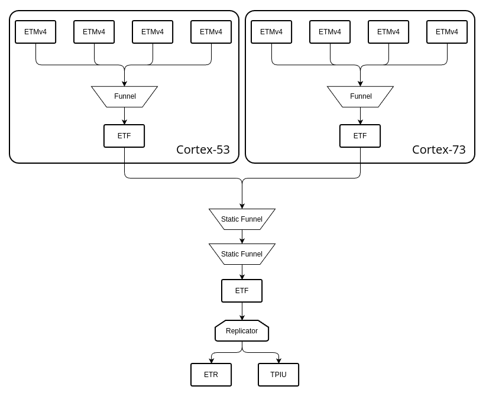

[toc]
# About
This ducumentation is about installing optee and test ARM CoreSight on Hikey960 board
Last updated: 30.9.2022

# Version
Ubuntu 20.04 with glibc 2.31 (Ubuntu 22.04 has wrong default glibc version for CSAL)
OPTEE 3.18.0

# Customize buildroot
`<optee project>/build/br-ext/` is the external rootfs

To pass files into the final rootfs, put them in `<optee project>/br-ext/board/hikey960/overlay/`

To change buildroot config, add a config line in `<optee project>/br-ext/configs/optee_generic`
- Clean (necessary) and rebuild the whole OPTEE project to valid new config, rebuilding only the buildroot doesn't work
- `make menuconfig` or modify `<optee project>/buildroot/.config` somehow doesn't work in this case

Packages might be useful:
| Name | Lines |
| ---- | ---- |
| python | BR_PACKAGE_PYTHON |
| taskset | BR2_PACKAGE_UTIL_LINUX_SCHEDUTILS <br> BR2_PACKAGE_UTIL_LINUX|
| gdb | BR2_PACKAGE_GDB <br> BR2_PACKAGE_GDB_DEBUGGER <br> BR2_PACKAGE_GDB_TUI |
| perf | <font color="#dd0000">Not able to install </font> |

`<optee project>/out-br/.config` is the final buildroot config

`<optee project>/out-br/target` contains the final rootfs

# Linux CoreSight driver
Default OPTEE linux doesn't have CoreSight support, replace the original linux with Hikey960 linux: https://github.com/96boards-hikey/linux.

To enable coresight driver, `make ARCH=arm64 menuconfig`  or modified `.config` under `<optee project>/linux/`. 

# Board Setup
### Boot modes
Normal mode: ON-OFF-OFF for normal start
Fastboot mode: ON-OFF-ON for flashing OP-TEE or AOSP
Recovery mode: ON-ON-OFF for flashing the firmware or using OP-TEE recovery procedure

### USB connections
Connect USB-UART cable as `tty/USB0`
- GND (black): PIN 1
- RXD (yellow): PIN 11
- TXD (orange): PIN 13
<br>

Check connections with `lsusb` and `/var/log/syslog`

Use GtkTerm to connect to UART console, settings is 115200-8-N-1


USB to USB-C cable for flashing board
- In fastboot mode board not connect as ttyUSBx but found by fastboot
- In recovery mode board connect as ttyUSB1
<br>

Flash HiKey960 firmware and AOSP
- HiKey960 comes with AOSP installed
- To reflash HiKey firmware: https://github.com/96boards-hikey/tools-images-hikey960
- To reflash AOSP: https://github.com/96boards/documentation/blob/master/ConsumerEdition/HiKey960/Installation/LinuxFastboot.md
<br>

Flash OP-TEE 
- Several teams have brought OP-TEE on HiKey 960. OP-TEE, 96boards, Google, Linaro.
- OP-TEE general build information: https://github.com/OP-TEE/build
- Do not install adb and fastboot from apt-get after you already installed the SDK	
- Use manifest hikey960.xml
- OP-TEE additional HiKey information: https://github.com/OP-TEE/build/blob/master/docs/hikey.md
- Getting BL2 error after flashing OP-TEE. However, OP-TEE recovery procedure fixed it!
<br>

Other Links
- Hikey960 Development Board User Manual: https://github.com/96boards/documentation/blob/master/ConsumerEdition/HiKey960/HardwareDocs/HardwareUserManual.md
- Hikey960 circuit diagram: https://github.com/96boards/documentation/blob/master/ConsumerEdition/HiKey960/HardwareDocs/HiKey960_Schematics.pdf

# CoreSight on Hikey960

### Find ROM table base address

Build and load `csinfo` kernel module provided by CSAL. To install linux header file for compiling optee kernel module, re-download and build a new linux from https://github.com/96boards-hikey/linux (don't use the built one in OPTEE project)


### Discover components and topology
Three ways to discover components and topology:
| Method | Description |
| ---- | ---- |
| `csscan.py` | Python script supplied by CSAL, parse ROM table automatically |
| devmem | Linux tool reading physical memory directly from `/dev/mem`, parse ROM table manually |
| linux device tree | https://github.com/linaro-swg/linux/blob/optee/arch/arm64/boot/dts/hisilicon/hi3660-coresight.dtsi |
<br>

Problems:
- Some addresses always report bus error. This is probably because some components are registered in ROM table, but not memory-mapped on Hikey960, only hardware debugger can access.
- <font color="#dd0000">Cross-core access problem</font>. `csscan.py` reports bus error when access components (except CTI) on other cores in same cluster, e.g. Cortex-53 core access Cortex-53 core. Segment fault when access another cluster, e.g. Cortex-53 core access Cortex-73 core.
- Using devmem purely without taskset gives same cross-core access error as `csscan.py`. However `taskset -c <anycore> devmem` doesn't report any error.
<br>

Two possible reasons for the cross-core problem are:
 - Hikey960 SoC design just doesn't allow cross-core access from software, but this can't explain why `taskset -c <anycore> devmem` works. 
 - Software lock mechanism. All components has value 0x3 in LSR register, which means SLM exists and component is locked. However, another problem occurs: <font color="#dd0000">the componnet is unlockable</font>, writing to LAR register through both devmem and kernel module (remap PA to VA and write to VA) can not change its value, LAR should be writable according to ARM documentation. My guess to this new problem is that programmable interface is not reserved for software on Hikey960. <br>

What I have tried in order to run `csscan.py` successfully:
- Because of the cross-core access problem, I first parsed the ROM table manually using devmem and get a sketch of the ROM table as below.
- After figuring out which component belongs to which core based on the ROM table sketch. I excluded all corrupted addresses (0xec040000 to 0xec800000, 0xecd10000 to 0xed740000) and run `csscan.py` on a single core (core 0) again, no bus error or segment fault anymore. However, the topology discovered by `csscan.py` was not complete, probably because only one core was left in this framework.
- The complete topology can be found in linux device tree
<br>

Output and topology:
```
0xec000000 Nested ROM table
	0xec004000 ***null***	
	0xec030000 ROM table
		0xec031000 Funnel
		0xec032000 TPIU 
		0xec033000 TMC buffer (ETB)
		0xec034000 CTI 
		0xec035000 STM-500
		0xec036000 TMC fifo (ETF)
		0xec037000 TM101 timestamp generator
		0xec038000 TM101 timestamp generator	
	0xec040000 ***bus error***
	0xec080000 ***bus error***
	0xec800000 ROM table
		0xec801000 Funnel
		0xec802000 TMC fifo
		0xec803000 CTI
		0xecc00000 Cortex-A53 ROM table
			0xecc10000 Cortex-A53 debug
			0xecc20000 Cortex-A53 CTI
			0xecc30000 Cortex-A53 PMU
			0xecc40000 Cortex-A53 ETM (core 0)
			0xecd10000 Cortex-A53 debug
			0xecd20000 Cortex-A53 CTI
			0xecd30000 Cortex-A53 PMU
			0xecd40000 Cortex-A53 ETM (core 1)
			0xece10000 Cortex-A53 debug
			0xece20000 Cortex-A53 CTI
			0xece30000 Cortex-A53 PMU
			0xece40000 Cortex-A53 ETM (core 2)
			0xecf10000 Cortex-A53 debug
			0xecf20000 Cortex-A53 CTI
			0xecf30000 Cortex-A53 PMU
			0xecf40000 Cortex-A53 ETM (core 3)
	0xed000000 ROM table
		0xed001000 Funnel
		0xed002000 TMC fifo
		0xed003000 CTI
		0xed400000 Cortex-A73 ROM table
			0xed410000 Cortex-A73 debug
			0xed420000 Cortex-A73 CTI
			0xed430000 Cortex-A73 PMU
			0xed440000 Cortex-A73 ETM (core 4)
			0xed510000 Cortex-A73 debug
			0xed520000 Cortex-A73 CTI
			0xed530000 Cortex-A73 PMU
			0xed540000 Cortex-A73 ETM (core 5)
			0xed610000 Cortex-A73 debug
			0xed620000 Cortex-A73 CTI
			0xed630000 Cortex-A73 PMU 
			0xed640000 Cortex-A73 ETM (core 6)
			0xed710000 Cortex-A73 debug
			0xed720000 Cortex-A73 CTI
			0xed730000 Cortex-A73 PMU
			0xed740000 Cortex-A73 ETM (core 7)
```

```
Coresight components scanning
@0xec000000    0x327 0x000 r0.0                        ROM table
@0xec030000    0x000 0x000 r0.0                        ROM table
@0xec031000    0x23b 0x908 r2.0  CS Funnel             funnel         <no arch>        in-ports:7
@0xec032000    0x23b 0x912 r4.0  CS TPIU               port           <no arch>        TPIU
@0xec033000    0x23b 0x961 r1.0  CS TMC                buffer         <no arch>        TMC:ETR memwidth:64 wb:8
@0xec034000    0x23b 0x906 r4.0  CS CTI                CTI            <no arch>        channels:4 triggers:8
@0xec035000    0x23b 0x963 r0.0  CS STM-500            STM            Arm STM rev1     ports:65536
@0xec036000    0x23b 0x961 r1.0  CS TMC                fifo           <no arch>        TMC:ETF size:4096 memwidth:128
@0xec037000    0x23b 0x101 r1.0  TM101 Timestamp       CoreSight timestamp generator
@0xec038000    0x23b 0x101 r1.0  TM101 Timestamp       CoreSight timestamp generator
@0xec040000 - device excluded from scan
@0xec080000 - device excluded from scan
@0xec800000    0x000 0x000 r0.0                        ROM table
@0xec801000    0x23b 0x908 r2.0  CS Funnel             funnel         <no arch>        in-ports:4
@0xec802000    0x23b 0x961 r1.0  CS TMC                fifo           <no arch>        TMC:ETF size:16384 memwidth:128
@0xec803000    0x23b 0x906 r4.0  CS CTI                CTI            <no arch>        channels:4 triggers:8
@0xecc00000    0x23b 0x4a1 r4.0  Cortex-A53 ROM        ROM table
@0xecc10000    0x23b 0xd03 r4.0  Cortex-A53 debug      core-debug     Arm v8.0-A rev0  aff=0x80000000 midr=0x410fd034 pfr=0x2222 dfr=0x10305106 bkpt:6 wpt:4 PMUv3 pc-sampling:3
@0xecc20000    0x23b 0x9a8 r4.0  Cortex-A53 CTI        CTI            Arm CTI rev0     aff=0x80000000 channels:4 triggers:8 gate
@0xecc30000    0x23b 0x9d3 r4.0  Cortex-A53 PMU        PMU (core)     Arm PMUv3 rev0   aff=0x80000000 counters:6 64-bit prescale exportable
@0xecc40000    0x23b 0x95d r4.0  Cortex-A53 ETM        ETM            Arm ETMv4 rev0   aff=0x80000000 pdsr=0x00000023 ETMv4.0 ts:64 bb cc min-ccit:4 retstack stall events:4 resources:16 addrcomp:4 ssc:1 pecomp:0 counters:2 seqstates:4 extin:30 extinsel:4
@0xecd10000 - device excluded from scan
@0xecd20000    0x23b 0x9a8 r4.0  Cortex-A53 CTI        CTI            Arm CTI rev0     aff=0x80000001 channels:4 triggers:8 gate
@0xecd30000 - device excluded from scan
@0xecd40000 - device excluded from scan
@0xece10000 - device excluded from scan
@0xece20000    0x23b 0x9a8 r4.0  Cortex-A53 CTI        CTI            Arm CTI rev0     aff=0x80000002 channels:4 triggers:8 gate
@0xece30000 - device excluded from scan
@0xece40000 - device excluded from scan
@0xecf10000 - device excluded from scan
@0xecf20000    0x23b 0x9a8 r4.0  Cortex-A53 CTI        CTI            Arm CTI rev0     aff=0x80000003 channels:4 triggers:8 gate
@0xecf30000 - device excluded from scan
@0xecf40000 - device excluded from scan
@0xed000000 - device excluded from scan
Scan coresight components complete.

ATB topology detection
ATB scan... @0xec031000    0x23b 0x908 r2.0  CS Funnel             funnel         <no arch>        in-ports:7 unlocked integration
		0->0  @0xec036000    0x23b 0x961 r1.0  CS TMC                fifo           <no arch>        TMC:ETF size:4096 memwidth:128 unlocked integration
ATB scan... @0xec035000    0x23b 0x963 r0.0  CS STM-500            STM            Arm STM rev1     ports:65536 unlocked integration
		0->4  @0xec031000    0x23b 0x908 r2.0  CS Funnel             funnel         <no arch>        in-ports:7 unlocked integration
ATB scan... @0xec036000    0x23b 0x961 r1.0  CS TMC                fifo           <no arch>        TMC:ETF size:4096 memwidth:128 unlocked integration
		0->0  @0xec032000    0x23b 0x912 r4.0  CS TPIU               port           <no arch>        TPIU unlocked integration
		0->0  @0xec033000    0x23b 0x961 r1.0  CS TMC                buffer         <no arch>        TMC:ETR memwidth:64 wb:8 unlocked integration
ATB scan... @0xec801000    0x23b 0x908 r2.0  CS Funnel             funnel         <no arch>        in-ports:4 unlocked integration
		0->0  @0xec802000    0x23b 0x961 r1.0  CS TMC                fifo           <no arch>        TMC:ETF size:16384 memwidth:128 unlocked integration
ATB scan... @0xec802000    0x23b 0x961 r1.0  CS TMC                fifo           <no arch>        TMC:ETF size:16384 memwidth:128 unlocked integration
		0: no downstream device found
ATB scan... @0xecc40000    0x23b 0x95d r4.0  Cortex-A53 ETM        ETM            Arm ETMv4 rev0   aff=0x80000000 pdsr=0x00000023 ETMv4.0 ts:64 bb cc min-ccit:4 retstack stall events:4 resources:16 addrcomp:4 ssc:1 pecomp:0 counters:2 seqstates:4 extin:30 extinsel:4 unlocked integration
		0->0  @0xec801000    0x23b 0x908 r2.0  CS Funnel             funnel         <no arch>        in-ports:4 unlocked integration
ATB topology detection complete.

CTI topology detection
@0xec032000    0x23b 0x912 r4.0  CS TPIU               port           <no arch>        TPIU
@0xec033000    0x23b 0x961 r1.0  CS TMC                buffer         <no arch>        TMC:ETR memwidth:64 wb:8
@0xec034000    0x23b 0x906 r4.0  CS CTI                CTI            <no arch>        channels:4 triggers:8
@0xec035000    0x23b 0x963 r0.0  CS STM-500            STM            Arm STM rev1     ports:65536
@0xec036000    0x23b 0x961 r1.0  CS TMC                fifo           <no arch>        TMC:ETF size:4096 memwidth:128
@0xec802000    0x23b 0x961 r1.0  CS TMC                fifo           <no arch>        TMC:ETF size:16384 memwidth:128
@0xec803000    0x23b 0x906 r4.0  CS CTI                CTI            <no arch>        channels:4 triggers:8
@0xecc10000    0x23b 0xd03 r4.0  Cortex-A53 debug      core-debug     Arm v8.0-A rev0  aff=0x80000000 midr=0x410fd034 pfr=0x2222 dfr=0x10305106 bkpt:6 wpt:4 PMUv3 pc-sampling:3
@0xecc20000    0x23b 0x9a8 r4.0  Cortex-A53 CTI        CTI            Arm CTI rev0     aff=0x80000000 channels:4 triggers:8 gate
@0xecc30000    0x23b 0x9d3 r4.0  Cortex-A53 PMU        PMU (core)     Arm PMUv3 rev0   aff=0x80000000 counters:6 64-bit prescale exportable
@0xecc40000    0x23b 0x95d r4.0  Cortex-A53 ETM        ETM            Arm ETMv4 rev0   aff=0x80000000 pdsr=0x00000023 ETMv4.0 ts:64 bb cc min-ccit:4 retstack stall events:4 resources:16 addrcomp:4 ssc:1 pecomp:0 counters:2 seqstates:4 extin:30 extinsel:4
@0xecd20000    0x23b 0x9a8 r4.0  Cortex-A53 CTI        CTI            Arm CTI rev0     aff=0x80000001 channels:4 triggers:8 gate
@0xece20000    0x23b 0x9a8 r4.0  Cortex-A53 CTI        CTI            Arm CTI rev0     aff=0x80000002 channels:4 triggers:8 gate
@0xecf20000    0x23b 0x9a8 r4.0  Cortex-A53 CTI        CTI            Arm CTI rev0     aff=0x80000003 channels:4 triggers:8 gate
CTI outputs:
	buffer @0xec033000
	ACQCOMP -> CTI @0xec034000 TRIGIN0
	FULL -> CTI @0xec034000 TRIGIN1
	CTI @0xec034000
	TRIGOUT0 -> buffer @0xec033000 FLUSHIN
	TRIGOUT1 -> buffer @0xec033000 TRIGIN
	TRIGOUT2 -> fifo @0xec036000 FLUSHIN
	TRIGOUT3 -> fifo @0xec036000 TRIGIN
	TRIGOUT4 not connected
	TRIGOUT5 not connected
	TRIGOUT6 -> port @0xec032000 FLUSHIN
	TRIGOUT7 -> port @0xec032000 TRIGIN
	STM @0xec035000
	TRIGOUTSPTE -> CTI @0xec034000 TRIGIN5
	TRIGOUTSW -> CTI @0xec034000 TRIGIN6
	TRIGOUTHETE not connected
	ASYNCOUT -> CTI @0xec034000 TRIGIN7
	fifo @0xec036000
	ACQCOMP -> CTI @0xec034000 TRIGIN2
	FULL -> CTI @0xec034000 TRIGIN3
	fifo @0xec802000
	ACQCOMP -> CTI @0xec803000 TRIGIN0
	FULL -> CTI @0xec803000 TRIGIN1
	CTI @0xec803000
	TRIGOUT0 not connected
	TRIGOUT1 not connected
	TRIGOUT2 -> fifo @0xec802000 FLUSHIN
	TRIGOUT3 -> fifo @0xec802000 TRIGIN
	TRIGOUT4 not connected
	TRIGOUT5 not connected
	TRIGOUT6 not connected
	TRIGOUT7 not connected
	core-debug @0xecc10000 (core)
	DBGCROSS -> CTI @0xecc20000 (core) TRIGIN0
	CTI @0xecc20000 (core)
	TRIGOUT0 -> core-debug @0xecc10000 (core) DBGREQ
	TRIGOUT1 -> core-debug @0xecc10000 (core) DBGRST
	TRIGOUT4 -> ETM @0xecc40000 (core) ETMEXTIN0
	TRIGOUT5 -> ETM @0xecc40000 (core) ETMEXTIN1
	TRIGOUT6 -> ETM @0xecc40000 (core) ETMEXTIN2
	TRIGOUT7 -> ETM @0xecc40000 (core) ETMEXTIN3
	PMU (core) @0xecc30000 (core)
	OVERFLOW -> CTI @0xecc20000 (core) TRIGIN1
	ETM @0xecc40000 (core)
	EXTMEXTOUT0 -> CTI @0xecc20000 (core) TRIGIN4
	EXTMEXTOUT1 -> CTI @0xecc20000 (core) TRIGIN5
	EXTMEXTOUT2 -> CTI @0xecc20000 (core) TRIGIN6
	EXTMEXTOUT3 -> CTI @0xecc20000 (core) TRIGIN7
	CTI @0xecd20000
	TRIGOUT0 not connected
	TRIGOUT1 not connected
	TRIGOUT2 not connected
	TRIGOUT3 not connected
	TRIGOUT4 not connected
	TRIGOUT5 not connected
	TRIGOUT6 not connected
	TRIGOUT7 not connected
	CTI @0xece20000
	TRIGOUT0 not connected
	TRIGOUT1 not connected
	TRIGOUT2 not connected
	TRIGOUT3 not connected
	TRIGOUT4 not connected
	TRIGOUT5 not connected
	TRIGOUT6 not connected
	TRIGOUT7 not connected
	CTI @0xecf20000
	TRIGOUT0 not connected
	TRIGOUT1 not connected
	TRIGOUT2 not connected
	TRIGOUT3 not connected
	TRIGOUT4 not connected
	TRIGOUT5 not connected
	TRIGOUT6 not connected
	TRIGOUT7 not connected
CTI inputs:
	port @0xec032000
	TRIGIN <- CTI @0xec034000 TRIGOUT7
	FLUSHIN <- CTI @0xec034000 TRIGOUT6
	buffer @0xec033000
	TRIGIN <- CTI @0xec034000 TRIGOUT1
	FLUSHIN <- CTI @0xec034000 TRIGOUT0
	CTI @0xec034000
	TRIGIN0 <- buffer @0xec033000 ACQCOMP
	TRIGIN1 <- buffer @0xec033000 FULL
	TRIGIN2 <- fifo @0xec036000 ACQCOMP
	TRIGIN3 <- fifo @0xec036000 FULL
	TRIGIN4 not connected
	TRIGIN5 <- STM @0xec035000 TRIGOUTSPTE
	TRIGIN6 <- STM @0xec035000 TRIGOUTSW
	TRIGIN7 <- STM @0xec035000 ASYNCOUT
	fifo @0xec036000
	TRIGIN <- CTI @0xec034000 TRIGOUT3
	FLUSHIN <- CTI @0xec034000 TRIGOUT2
	fifo @0xec802000
	TRIGIN <- CTI @0xec803000 TRIGOUT3
	FLUSHIN <- CTI @0xec803000 TRIGOUT2
	CTI @0xec803000
	TRIGIN0 <- fifo @0xec802000 ACQCOMP
	TRIGIN1 <- fifo @0xec802000 FULL
	TRIGIN2 not connected
	TRIGIN3 not connected
	TRIGIN4 not connected
	TRIGIN5 not connected
	TRIGIN6 not connected
	TRIGIN7 not connected
	core-debug @0xecc10000 (core)
	DBGREQ <- CTI @0xecc20000 (core) TRIGOUT0
	DBGRST <- CTI @0xecc20000 (core) TRIGOUT1
	CTI @0xecc20000 (core)
	TRIGIN0 <- core-debug @0xecc10000 (core) DBGCROSS
	TRIGIN1 <- PMU (core) @0xecc30000 (core) OVERFLOW
	TRIGIN2 not connected
	TRIGIN3 not connected
	TRIGIN4 <- ETM @0xecc40000 (core) EXTMEXTOUT0
	TRIGIN5 <- ETM @0xecc40000 (core) EXTMEXTOUT1
	TRIGIN6 <- ETM @0xecc40000 (core) EXTMEXTOUT2
	TRIGIN7 <- ETM @0xecc40000 (core) EXTMEXTOUT3
	ETM @0xecc40000 (core)
	ETMEXTIN0 <- CTI @0xecc20000 (core) TRIGOUT4
	ETMEXTIN1 <- CTI @0xecc20000 (core) TRIGOUT5
	ETMEXTIN2 <- CTI @0xecc20000 (core) TRIGOUT6
	ETMEXTIN3 <- CTI @0xecc20000 (core) TRIGOUT7
	CTI @0xecd20000
	TRIGIN0 not connected
	TRIGIN1 not connected
	TRIGIN2 not connected
	TRIGIN3 not connected
	TRIGIN4 not connected
	TRIGIN5 not connected
	TRIGIN6 not connected
	TRIGIN7 not connected
	CTI @0xece20000
	TRIGIN0 not connected
	TRIGIN1 not connected
	TRIGIN2 not connected
	TRIGIN3 not connected
	TRIGIN4 not connected
	TRIGIN5 not connected
	TRIGIN6 not connected
	TRIGIN7 not connected
	CTI @0xecf20000
	TRIGIN0 not connected
	TRIGIN1 not connected
	TRIGIN2 not connected
	TRIGIN3 not connected
	TRIGIN4 not connected
	TRIGIN5 not connected
	TRIGIN6 not connected
	TRIGIN7 not connected
CTI topology detection complete
```
   


### Coresight configuration
```C
// Only register core 0, and register ETR as ETB in cs_devices_t because ETR is not supported by CSAL API. 
static int do_registration_hikey960(struct cs_devices_t *devices){
    enum { A53_0, A53_1, A53_2, A53_3, A73_0, A73_1, A73_2, A73_3 };
    cs_device_t funnel_top, etf_top, rep_top, tpiu;
    cs_device_t funnel_combo;
    cs_device_t funnel_a53, etf_a53;

    if (registration_verbose)
        printf("CSDEMO: Registering Snowball CoreSight devices...\n");
    cs_exclude_range(0xec004000, 0xec005000);
    cs_exclude_range(0xec040000, 0xec090000);
    cs_exclude_range(0xecd10000, 0xecf50000);
    cs_exclude_range(0xed000000, 0xed750000);

    cs_register_romtable(0xec000000);

    if (registration_verbose)
        printf("CSDEMO: Registering CPU affinities...\n");
    /* PTMs */
    cs_device_set_affinity(cs_device_register(0xecc40000), A53_0);

    /* CTIs */
    cs_device_set_affinity(cs_device_register(0xecc20000), A53_0);

    if (registration_verbose)
        printf("CSDEMO: Registering trace-bus connections...\n");

    funnel_a53 = cs_device_get(0xec801000);
    etf_a53 = cs_device_get(0xec802000);
    funnel_combo = cs_atb_add_static_funnel(2); // Modified from cs_atb_add_replicator, useless, static funnel doesn't need to be registered.
    funnel_top = cs_device_get(0xec031000);
    etf_top = cs_device_get(0xec036000);
    rep_top = cs_atb_add_replicator(2);
    devices->etb = cs_device_get(0xec033000);
    tpiu = cs_device_get(0xec032000);

    cs_atb_register(cs_cpu_get_device(A53_0, CS_DEVCLASS_SOURCE), 0, funnel_a53, 0);
    cs_atb_register(funnel_a53, 0, etf_a53, 0);
    cs_atb_register(etf_a53, 0, funnel_combo, 0);
    cs_atb_register(funnel_combo, 0, funnel_top, 0);
    
    cs_atb_register(funnel_top, 0, etf_top, 0);
    
    cs_atb_register(etf_top, 0, rep_top, 0);

    cs_atb_register(rep_top, 0, tpiu, 0);
    cs_atb_register(rep_top, 1, devices->etb, 0);

    return 0;
}
```


### Run tracedemo
Because only a single core (core 0) is registered, `board->n_cpu` must be changed to 1, so that every loop for cpu traversing will only access core 0.

Tracedemo run successfully, but the trace data output is always 0x00, it is probably because I registered trace sink as ETB, which was read directly by CSAL. However, Hikey960 only has ETR, ETR won't store any trace data but route them to system memory. <font color="#dd0000">ETR is not supported by CSAL yet</font>. 

